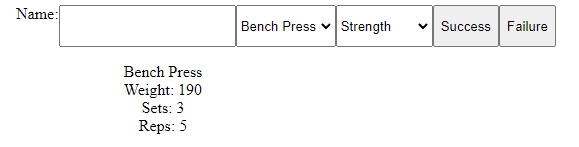

# Team Name: Tripai
## Application Name: Weightlifting Planner
## Team Overview: Team member name: Tristan Duerk. His GitHub username: tristanduerk. This is an individual project.
## Application Idea: My application is a weightlifting planner. It keeps a registry of potential exercises and suggests exercises that go together. It will also have different plan outlines based on different goals that a person can choose. It will track a person's lift history from starting the program, and suggest weight increments to help with progressive overload. Lastly, it will give you procedures for safe lifting (by showing lifting technique and providing the right steps).
## Functionality: The weightlifting planner will work by keeping a background database storing the list of exercises. The different plans that a person can choose will be a dropdown menu that you can pick from at the top including things such as: Strength, Explosiveness, Hypertrophy (Aesthetics/Looks). To track the person's lift history from starting the program, the web application will use a small local datafile so people can track their progress as well as get suggestions on increasing the weight at safe amounts to continue progressing without getting injured. The last part for safe lifting will be that there is a section where you can click on an exercise and it will show a procedure to properly perform lifts, so as to help prevent injury.

## The first part of the interface is the input section. It has a place to input the individual's name to be stored in local storage. It also has a dropdown menu to pick from (currently) 3 exercises: Bench Press, Back Squat, and Deadlift. It has another dropdown menu to pick between the programs Strength, Hypertrophy, and Athleticism. This currently does not have any functionality. However, later this will change the exercise options as well as the rep scheme. Finally, it has two buttons: Success and Failure. The success button, when clicked, adds 5 pounds to the person's lift, and the Failure button subtracts 5 pounds from the person's lift. Data is saved to the back end server. Finally, below it all has the exercise printed out with the weight and rep scheme for the person to follow.

## Link to application running: https://drive.google.com/file/d/124KZH55IRU6brp6fCv4mf59MN32j5eqM/view